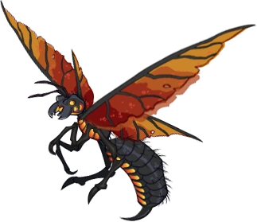

## Outline
1. [Overview](Overview)
   1. [Session Important Notes](#session-important-notes)
   2. [Session Actions Taken](#session-actions-taken)
2. [Session Details](#session-details)

3. [Items & XP](#items--xp)
   1. [Items Received](#items-received)
   2. [Experience Received](#experience-received)
4. [Conclusions](#conclusion-items)
   1. [Active Questions](#active-question-notes-self)
   2. [Action Items](#action-items-(previous))
   3. [Map Marks](#map-marks)
5. [Previous Items](#previous-items)
   1. [Previous Action Items](#previous-action-items)
   2. [Previous Map Marks](#previous-map-marks)
   3. [Previous Items Added](#previous-items-added)
______________________________
## Overview
**Previous Session Recap:**
- Refer to [23-MAR-25](23-MAR-25.md) Notes 
- Finished up exploring in IO / shopping

_____________________________________
## Session Details
### Traveling to Mechancius
- Heading toward Mechancius from IO
- Will be 3 days

#### Day 1
_Actively traveling to Mechancius (3 days still needed)_

##### Airship 
- Nothing on spot check / normal for travel 
- Helra keeps an eye on Pingle and Tingle (knomes) that are on board
- ALabaster reads his book
- Taurus will be boosting the morale for army members that are on the ship

#### Day 1
- Hallamir keeps an eye out / spot check
  - To the South east of IO there are some small settlements noticed from IO 
  - Minning settlement as well. There are a bunch of dwarves rushing out of a mine shaft rushing around
  - There are guards fighting something that is coming out of the mine shaft. 
  - Choosing to engage with the situation

##### Minning Settlement Battle
- Hallamir, Helra, Taurus, Harrum
- Alabaster reading
- Airdropping in- Hallamir with Harrum and Taurus with Helra
- Flying inscets / wasp like
- Alabaster will be 'watching' via the scrying sphere and use Harrum as the target
- 3 squarms and 1 queen

- 55 Heal Slaps out of the 60 available for today

**NEED TO RESTORE ABILITY SCORE DAMANGE**
(Hallamir and Helra)

- Returned to Airship
___________________________________________

## Items & XP
### Items Received
- N/A

### Experience Received
**Previous Total:** 81,688 _(Updated with Discord version)_
**Adjustments:** +975 EX
**Total:** 82,663

_________________________________
## Conclusion Items
### Active Question Notes (Self)
- Talking with the Nymmurh 

### Action Items
- Need finish asking Nymmurh questions

### Map Marks
- Draconic Cave Entrance 
- Dust Man / Travelers Inn

---------------------------------
## Previous Items
### Previous Action Items
- [ ] Alabaster wishes to visit the magic shop at some point in time that we almost got caught stealing from in the past / got locked up that was nearby. Geistwatch. Ruby golem.
- [ ] Alabaster wants to grab the winter cloths he left in the cart that is on the ship doing shipments.
- [ ] Alabaster tells his imp that he should keep an eye out on what person would be good to kill for a ritual spell that he his thinking about doing. 
- [ ] To check-in with Ferbin at some point when in Clambank on the shipment of steel and weapons and if there is a prep for war or something or general shipment. (Town that had faulty ore orginally)

#### Previous Map Marks
- **Marked Stagfort** on the map
- **Marked the ship anchor** on the map for investigating
- **Marked Redleaf** on the map
- **Marked which trail was used more** from the abandon Pitish village
  - North West direction
- **Marked** Witch Hut in Horde grave swamp  (On route to IO)
- **Marked Horsegrave** to avoid due to drunk crusades   (On route to IO)
- **Marked** prototype dragon location  (On route to IO)
- **Marked** Draconic Cave Entrance   (On route to IO)
- **Marked** Dust Man Travelers Inn   (On route to IO)

#### Previous Items Added
_Listing of items that haven't been added to inventory notes yet from previous sessions for reference so they do not get forgotten._
- **Prototype Manual** 
  - For (D.R.A.G.O.N.)