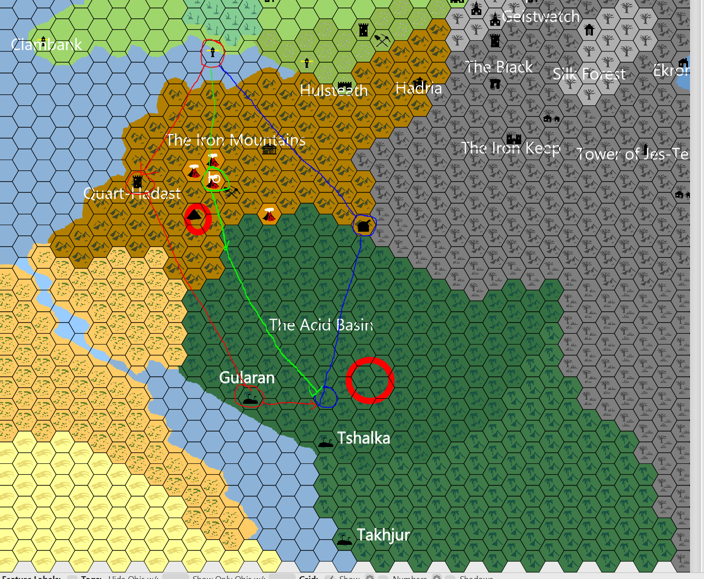

## Outline
1. [Overview](Overview)
   1. [Session Important Notes](#session-important-notes)
   2. [Session Actions Taken](#session-actions-taken)
2. [Session Details](#session-details)
   1. [Day 1](#day-1--journey-to-snek-quest-line)
   2. [Day 2](#day-2)
   3. [Day 3](#day-3)
   4. [Day 4](#day-4)
   5. [Day 5](#day-5)
   6. [Day 6- Witch Hut](#day-6--witch-hut-)
   7. [Day 7](#day-7)
   8. [Day 8](#day-8-24th-of-slate) 
3. [Items & XP](#items--xp)
   1. [Items Received](#items-received)
   2. [Experience Received](#experience-received)
4. [Conclusions](#conclusion-items)
   1. [Active Questions](#active-question-notes-self)
   2. [Action Items](#action-items-(previous))
   3. [Map Marks](#map-marks)
5. [Previous Items](#previous-items)
   1. [Previous Action Items](#previous-action-items)
   2. [Previous Map Marks](#previous-map-marks)
______________________________
## Overview
**Previous Session Recap:**
- Refer to [18-AUG-24](18-AUG-24.md) Notes 

### **Session Important Notes:**
- Going to continue on the snek quest line 
- Stregore staying at the keep (same with Gregory)
- Goobrian staying at the keep
- Lethe coming on journey 
- Bringing some humans on the journey for backup (not the water rats
 - Half infantry and half archery
 - Yoni Buglehole (working captain)
- Find a witch hut in the horse grave swamps

### **Session Actions Taken:**
- Going to continue on the snek quest line
- Alabaster learns some spells
  - Remove curse
  - Corpse candle

_____________________________________
## Session Details
### Day 1- Journey to Snek quest line
- Path options available are towards people that we know of like the turtle city, floating library, and the jungle elves.
- Brass dragon city is the blue path (Mechconis)
- Options are shown in the following image:

- Decided to do the blue path
- Taking the air ship
- 9 days of travel to get to Mechconis
- Take the people listed in [Session Important Notes](#session-important-notes)
- Spot nothing on the way / have some people wave.
- **Alabaster learns** REMOVE CURSE
_____________________________________

### Day 2
- People over their air sickness
- Hallamir spot check ->  trees
- **Alabaster learns** corpse candle
_____________________________________

### Day 3
- Pignut is released and helping with the cooking.
- Hallamir spots nothing
- Alabaster reads 58.1% done with Mitheral 1

### Day 4
- Hallamir spots nothing
- Alabaster reads / 62.1% done with Mitheral 1
- Flying over the swamp

### Day 5
- Hallamir spots something over the swamp / horse grave
  - Sees something in the reeds / an ancient carriage  
  - 30 years old probably
- Alabaster reading hard -> 64.8% done through Mitheral 1 

### Day 6- Witch Hut 
- Hallamir spots a hunt in the swamp with smoke coming out
- Witch Hut
  - Cassrole -> Taurus  
  - Tne jar of strange magic honey
  - Rat tail bedroll
  - Lethe sense something bad
  - Get to keep the magic honey
  - She knows healing / would take awhile to learn
  - Her son does the hunting 
  - Probably not human too 

### Day 7
- Hallamir doesn't find anything really
- Should be able to arrive in Horse grave the next day.
- Alabaster reads 

### Day 8 (24th of Slate)
- Arrives at the port of Horse grave

___________________________________________

## Items & XP
### Items Received
- Jar of strange magic honey

### Experience Received
- Total: 80,967

_________________________________
## Conclusion Items
### Active Question Notes (Self)
- None

### Action Items
- Maybe want to visit the witch again but will have to be careful

## Map Marks
- Witch Hut in Horde grave swamp

---------------------------------
## Previous Items
### Previous Action Items
- Alabaster wishes to visit the magic shop at some point in time that we almost got caught stealing from in the past / got locked up that was nearby.
- Alabaster wants to grab the winter cloths he left in the cart that is on the ship doing shipments.
- Alabaster tells his imp that he should keep an eye out on what person would be good to kill for a ritual spell that he his thinking about doing. 
#### Previous Map Marks
- **Marked Stagfort** on the map
- **Marked the ship anchor** on the map for investigating
- **Marked Redleaf** on the map
- **Marked which trail was used more** from the abandon Pitish village
  - North West direction