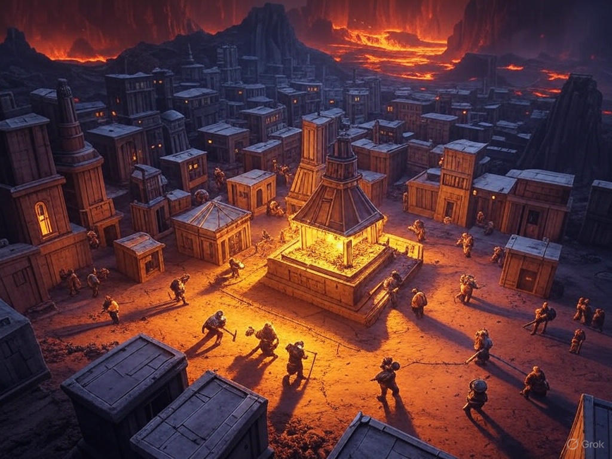

## Outline
1. [Overview](Overview)
   1. [Session Important Notes](#session-important-notes)
   2. [Session Actions Taken](#session-actions-taken)
2. [Session Details](#session-details)

3. [Items & XP](#items--xp)
   1. [Items Received](#items-received)
   2. [Experience Received](#experience-received)
4. [Conclusions](#conclusion-items)
   1. [Active Questions](#active-question-notes-self)
   2. [Action Items](#action-items-(previous))
   3. [Map Marks](#map-marks)
5. [Previous Items](#previous-items)
   1. [Previous Action Items](#previous-action-items)
   2. [Previous Map Marks](#previous-map-marks)
   3. [Previous Items Added](#previous-items-added)
______________________________
## Overview
**Previous Session Recap:**
- Refer to [23-MAR-25](23-MAR-25.md) Notes 
- On the way to IO / Traveling via Airship
- Had a stop to at an old Travelers Rest for Drawfs 
- Hallamir is now blue forever
- Updated the Airship log.

_____________________________________
## Session Details
### Traveling to IO
- Heading toward Mechancius but stopping at IO first.
- Will be 4 days until getting to IO in airship.
  - Increased to 5 days with modification to route

#### Day 5
_Actively traveling to IO (Last day until at IO) Last stop was on day 4 to check out the Stone Oboliesk_
- Pignut back in the bag
- Hallamir is blue
- The weather is warm and still
- Hallamir Spot: Can see the change in the terrian. Blue pools of water can be seen with steam. There are a number of dwarves around / crowds and groups above ground. Hot springs in IO. Very humid.
- Taurus wants to see if there are some surface settlements
- There is a sub fortress area / caravans moving about, large stone elevators moved with large stones. Giant cranes as well. This might be a good location to put the ship down by these large open areas for moving large objects.

##### IO- Day 1
- Helra flys down to give them a bit of an alert that we are coming to land in this spot. Takes Taurus on my back. 
- Some guards are around with the knight sticks.
- Brotherhood of Steel gang of dwarfs 
- They make weapons (key point)
- Saved a town from an earth elemental that is associated with this city.
- Black Forge
- Gladmac brickpike: Guard that steps forward to greet and asks what and who are we.
- Helra translates to Hallamir. Taurus is the main communicator to the guards / speaks dwarvian. 
- They will give us an essort and offer some resources and point things out. 
- They don't really care / human friendly if you have coin.
- Probably stay here for 2 days
- Can have dwarves with each human we have to have a break time on port. Split it into half our people get a break one day and the other half gets to explore the next day. 
- Taurus gives a speach to the men to make sure they are going to behave.
  - Appears to work at least they listened
- Make our way into IO and see the pools of magma and a bunch of bridges. Very hot here / in the volanco.
- **Taurus, Hallamir, and Helra take off their armour** / very hot.
- We are taken to the nobles quaters at the palace. 

_Bonfire location in IO_

- In the noble quarters, its elevated and a bit cooler in comparison.
- Helra will be checking out if there are any religious points in the engravens 
  - Morgin? (Forge father) [normal one]
  - Tharmekhul (Fire and molten rock) [main local deity]
- Very noisey with the forge and power hammers
- Passed off to another dwarf named- Vabeack Magmabraids
  - He is in charge of the servants / head
  - Will be attending to us while we are here.
- Hallamir wants to find a lock smith

###### IO- Locksmith
- Hallamir is checking out locks and seeing if he can pick them to give them a go.
- First lock:
  - Cheaper lock: Hallamir can pick it
- Second lock:
  - More expensive: Hallamir can pick it
- Third Lock:
  - Jewerly lock: Hallamir can pick it
  - Definitely more difficult but can pick it still
- Fourth Lock:
  - Definitely more fancier than the others
  - Heavier and of good quality 
  - Hallamir fails 
  - 150 gold 
  - Comes key at least
  - Amazing Dwarvian Lock: (name)
- Hallamir gets the lock
- Lock smith also has a couple of different lock picking sets to choose from.
  - Dwarven Masterwork Lock picking set
  - Dwarven Skeleton Key 
- Hallamir gets the Amazing Dwarvian Sketeton Key, Masterwork Lock picking set, and Amazing Dwarvian Lock.

**NOTE:** Will do items for next time then for shops and such. 

___________________________________________

## Items & XP
### Items Received
- N/A

### Experience Received
**Previous Total:** 81,454 _(Updated with Discord version)_
**Adjustments:** +234 from previous session battle
**Total:** 81,688

_________________________________
## Conclusion Items
### Active Question Notes (Self)
- Talking with the Nymmurh 

### Action Items
- Need finish asking Nymmurh questions

### Map Marks
_List of newly added map marks that pertain to this session._

---------------------------------
## Previous Items
### Previous Action Items
- [ ] Alabaster wishes to visit the magic shop at some point in time that we almost got caught stealing from in the past / got locked up that was nearby. Geistwatch. Ruby golem.
- [ ] Alabaster wants to grab the winter cloths he left in the cart that is on the ship doing shipments.
- [ ] Alabaster tells his imp that he should keep an eye out on what person would be good to kill for a ritual spell that he his thinking about doing. 
- [ ] To check-in with Ferbin at some point when in Clambank on the shipment of steel and weapons and if there is a prep for war or something or general shipment. (Town that had faulty ore orginally)

#### Previous Map Marks
- **Marked Stagfort** on the map
- **Marked the ship anchor** on the map for investigating
- **Marked Redleaf** on the map
- **Marked which trail was used more** from the abandon Pitish village
  - North West direction
- **Marked** Witch Hut in Horde grave swamp  (On route to IO)
- **Marked Horsegrave** to avoid due to drunk crusades   (On route to IO)
- **Marked** prototype dragon location  (On route to IO)
- **Marked** Draconic Cave Entrance   (On route to IO)
- **Marked** Dust Man Travelers Inn   (On route to IO)

#### Previous Items Added
_Listing of items that haven't been added to inventory notes yet from previous sessions for reference so they do not get forgotten._
- **Prototype Manual** 
  - For (D.R.A.G.O.N.)