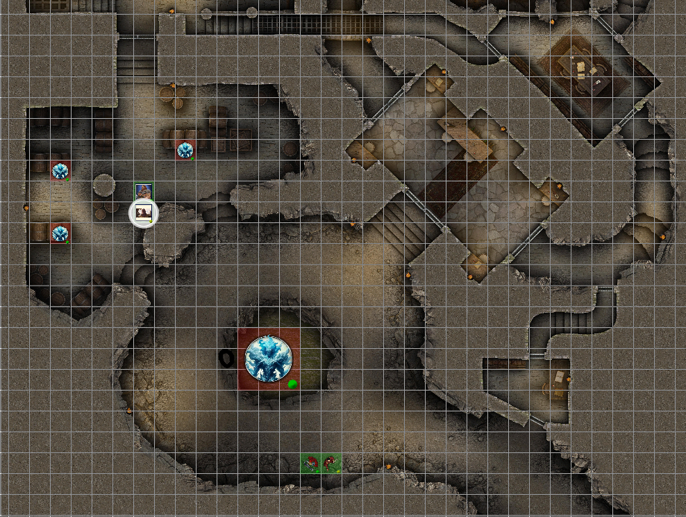
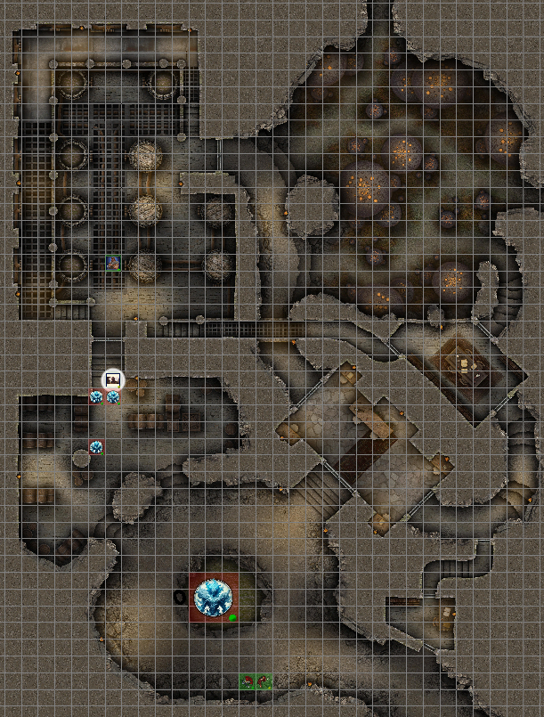

## Outline
1. [Overview](Overview)
   1. [Session Important Notes](#session-important-notes)
   2. [Session Actions Taken](#session-actions-taken)
2. [Session Details](#session-details)
   1. [Day 1- Drunk Spree Day](#day-1--drunk-spree-day) 
      1. [Taurus & Hallamir's Adventures](#taurus-and-hallamir-adventures)
         1. [Whiskey Battle](#whiskey-elemental-fight)
      2. [Lethe & Harrim's Adventures](#lethe--harrim-adventures)
         1. [Skill Challenge](#skill-challenge-)
      3. [Ship Gathering](#ship-gathering)
3. [Items & XP](#items--xp)
   1. [Items Received](#items-received)
   2. [Experience Received](#experience-received)
4. [Conclusions](#conclusion-items)
   1. [Active Questions](#active-question-notes-self)
   2. [Action Items](#action-items-(previous))
   3. [Map Marks](#map-marks)
5. [Previous Items](#previous-items)
   1. [Previous Action Items](#previous-action-items)
   2. [Previous Map Marks](#previous-map-marks)
______________________________
## Overview
**Previous Session Recap:**
- Refer to [01-SEP-24](01-SEP-24.md) Notes 
- Drug spree day / Hallamir, Taurus, Pignut, Lethe, and Harrim

### **Session Important Notes:**
- Managed to get everyone back onto the ship with only some damage
  - Broken into the brewery (Taurus and Hallamir)
  - Damage to local town (Harrim, Lethe, and Pignut)
- Probably want to avoid that area now for future reference

### **Session Actions Taken:**
- Care package to the major for the damage done
- Returned the items back to the major

_____________________________________
## Session Details
### Day 1- Drunk Spree Day
- Pignut Runs off by himself
- Lethe runs off by himself
    - Helra goes to follow
- Harrim runs off by himself
    - Alabaster goes to follow
#### Taurus and Hallamir Adventures
  - Go back to the brewery 
  - Hallamir breaks into the brewery (20 roll)
  - Taurus wants to setup a place in the keep with these goodies
  - Brewery is dark inside
    - Owner went to walk home afterwards
    - No workers in sight / was an off day for when they did this
  - Hallamir drinks some more -> more drunk (drinking some of the leftovers from the tasting)
  - Taurus drinks some more as well with Hallamir -> same status (drinking some of the leftovers from the tasting)
  - They notice a door that goes into the basement for the brewery (locked)
    - Hallamir is able to pick the lock
    - They go down into the basement
    - There is a spring of water -> Hallamir sips -> Taurus sips and washes his beard
      - There is an offering nearby 
      - Upset water elemental
        - It attacks
  
#### Lethe & Harrim Adventures
- Lethe thinks she is a princess
- Harrim thinks he is a hero / on a quest 
- Lethe believes this as well
- They start running off trying to shake off Alabaster and Helra

##### Skill Challenge 
- Alabaster is flying (1 win)
- Helra listens for them (2 win)
  - Learns that they are heading for the church 
- Alabaster is searching for a good path to cut them off (1 loss / rolls a 1)
  - They gain some ground
  - Harrim carries Lethe and jumps over a section / not going to that path
  - Harrim knocks a bunch of tiles off a building -> reflex saving throw for Helra on ground (passes)
    - Old man in the house is mad
    - Helra uses Diplomacy to the old man that we are handling the situation (3 win)
- Alabaster concentrates (4 win)
- Manage to catch up to them -> they fall after another building jump and fall into a hay wagon
  - There quest was to ring the bell on the top of the church to greet the new king (Pignut)
  - New group of people come out of this house 
  - Helra asks / yell 'where is the mayors house' -> where Pignut is potentially heading
  - They point up the road / Alabaster see the house that is of higher status with all the lights up. 
  - Alabaster flies over to the house -> guards at the gate -> more in the garden -> there is something happening
    - Window breaks and two figures come out 
      - One if the mayor
      - Second is Pignut with a tricorn hat, with robes
      - They are fighting over a large gold chain necklace
      - Alabaster casts feather fall on them 
      - Pignut gets the necklace and stands on top of the mayor and proclaims himself as the king
      - Alabaster teleports to Pignut and himself to the ship
      - Pignut gets stuffed into the bag of holding again
- Helra tosses a silver at the owner of the hay wagon and starts wheeling Lethe and Harrim to the mayors house / where Alabaster is.
_____________________________________

##### Whiskey Elemental Fight
- Caused by Taurus and Hallamir drinking and bathing in the water spring in the basement of brewery 
  - Hallamir slaps a bottle onto the altar as a 'piece offering'
    - Bottle breaks / alter falls over / broken glass into the water
    - Hits Hallamir for 24 damage 
  - Taurus runs and grabs Hallamir fireman style and hide behind one of the pillars
    - Water elemental cannot go out of the pool but the barrels nearby start to quiver 
    - More elementals come out of the barrels now.
  - Taurus says 'rat bat bat rat' multiple times
  - Hallamir turns into a bat with it being dark enough / can travel faster
    - Goes to a door but cannot open it. Does not crash into the door though.
  - Taurus takes some damage
  - Both are able to escape the whiskey elementals

##### **Battle Maps:** 

_____________________________________

#### Ship Gathering
- Marcus is going around giving water and such around.
    - (Happens everytime we dock)
- Helra eventually turns up to the ship wheeling Lethe and Harrim
- Alabaster appraises the necklace from the mayor to be ~25 gold (expensive)
- Alabaster appraises the damage on the window ~10 gold
- Helra interrogates Pignut through the bag of holding
  - **Damage:** (2) windows, (1) mirror, broke the lock, pooped in the closet, kitchen fire, flower bed damage, rug damaged with poop, mayor room damaged, the bed is damaged, tapatery is damaged,glassware on the nightstand damaged, treasurey box damaged, grease fire
  - Pignut doesn't want to talk until showing him the chain / telling him that Helra is the king now
  - **Estimated Damage:** 250 gold
- Sent a care package to the major with money and the stolen goodies
___________________________________________

## Items & XP
### Items Received
- Wagon filled with hay
- Shame

### Experience Received
- Total: 80,967

_________________________________
## Conclusion Items
### Active Question Notes (Self)
- None

### Action Items

## Map Marks
- Town that was damaged for reference of a place to avoid.

---------------------------------
## Previous Items
### Previous Action Items
- Alabaster wishes to visit the magic shop at some point in time that we almost got caught stealing from in the past / got locked up that was nearby.
- Alabaster wants to grab the winter cloths he left in the cart that is on the ship doing shipments.
- Alabaster tells his imp that he should keep an eye out on what person would be good to kill for a ritual spell that he his thinking about doing. 
#### Previous Map Marks
- **Marked Stagfort** on the map
- **Marked the ship anchor** on the map for investigating
- **Marked Redleaf** on the map
- **Marked which trail was used more** from the abandon Pitish village
  - North West direction
- **Marked** Witch Hut in Horde grave swamp