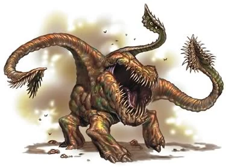
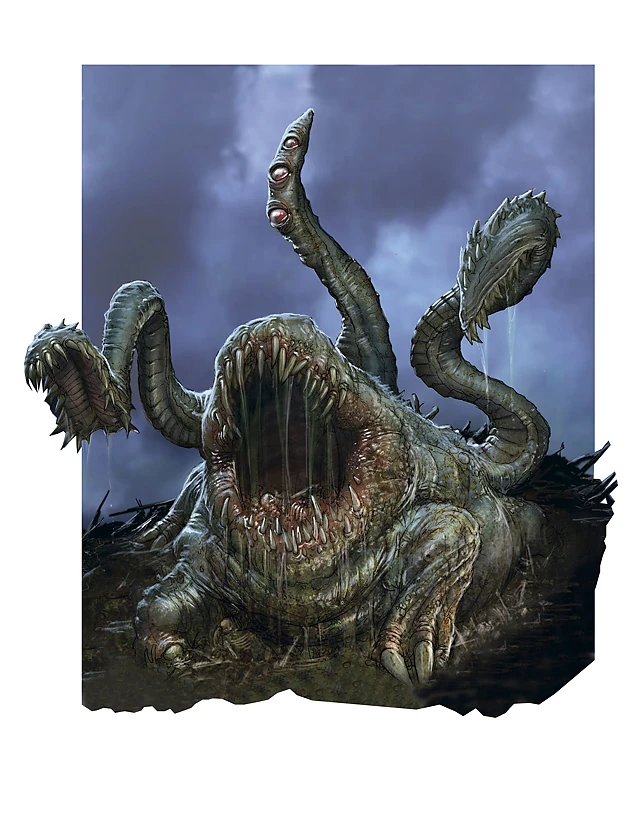
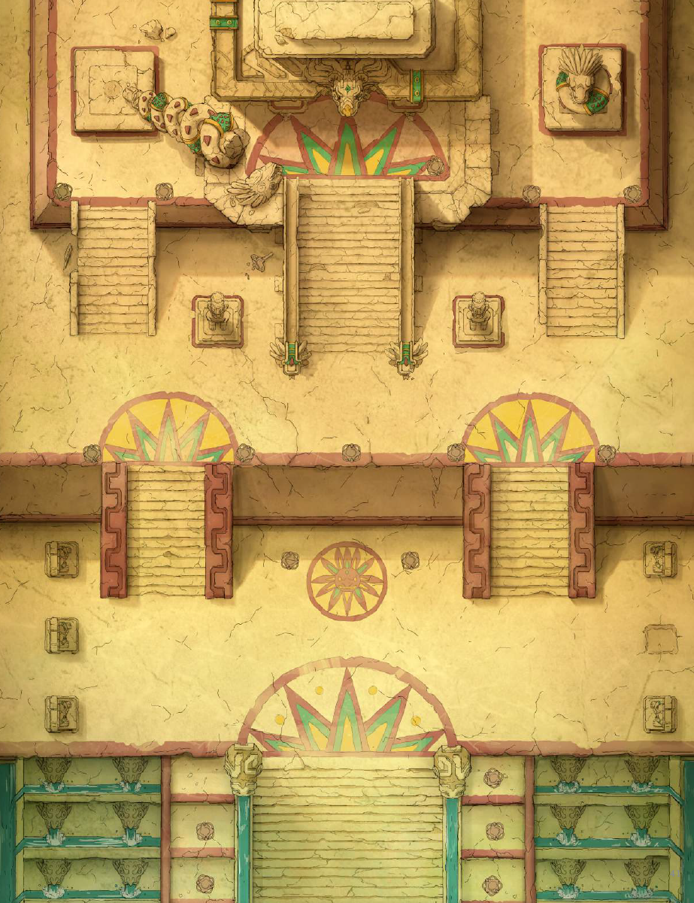
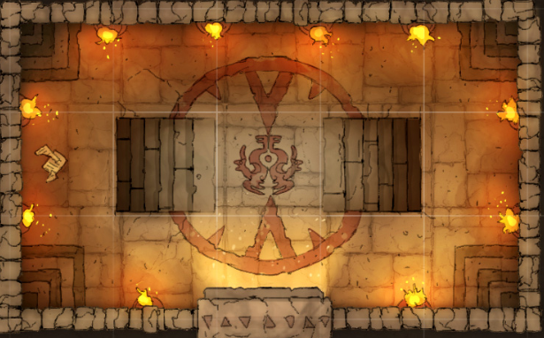
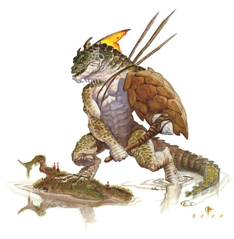

## Outline
1. [Overview](Overview)
   1. [Session Important Notes](#session-important-notes)
   2. [Session Actions Taken](#session-actions-taken)
2. [Session Details](#session-details)

3. [Items & XP](#items--xp)
   1. [Items Received](#items-received)
   2. [Experience Received](#experience-received)
4. [Conclusions](#conclusion-items)
   1. [Active Questions](#active-question-notes-self)
   2. [Action Items](#action-items-(previous))
   3. [Map Marks](#map-marks)
5. [Previous Items](#previous-items)
   1. [Previous Action Items](#previous-action-items)
   2. [Previous Map Marks](#previous-map-marks)
   3. [Previous Items Added](#previous-items-added)
______________________________
## Overview
**Previous Session Recap:**
- Refer to [03-AUG-25](03-AUG-25.md) Notes 
- Traveling over the Acid Basin
- Spotted an elvian site with odd structures in the jungle
- Had a run in with the obolisks shotting at the ship
- Ship is a bit damaged but we have landed
- Non-elfs are impacted by a barrier
- Traveling down into the heart of the 'city' area

_____________________________________
## Session Details
> [!Note]
> _Sections that are copied from the previous session are indictated (easier to see all of the same parts in on location)_

### Airship 
_Copy over from previous notes_
- Head off / leave Mechancius / heading toward snek temple location

#### Day 1
_Copy over from previous notes_
- Hallamir keeps an eye out / spot check
  - Spotted some bees
  - We decide not to engage 
- Alabaster Reads again= 86% done

#### Day 2
_Copy over from previous notes_
- Hallamir keeps an eye out / spot check
  - soar wood spotted up ahead that is in the way 
  - Helra grabs it / takes care of it.
- Alabaster reads = 89.6% done

#### Day 3
_Copy over from previous notes_
- Traveling over the acid basin still
- Hallamir keeps an eye out / spot check (21)
  - Nothing / just hot and humid
- Alabaster reads -> 93% done
- Taurus teaches crew on the canon just installed
  - Diplomacy check 

#### Day 4
_Copy over from previous notes_
- Hallamir keeps an eye out / spot check 
  - Starts to see odd structures within the jungle down below
  - Starting become cloudy now but still hot / humid
  - Spyglass -> there is a little clearing and a black oblosick and another one not to far away
- Alabaster can pick up more background magic in the area besides the airship magic
  - Concerened / confused 
- General: Alabaster Knowledge
  - mithrels can be created within an obolisk 
  - Elves did something similar to this in the past for storing magick 
  - Magick wards, weather protection, etc
  - Might be something similar to this / leftover artifacts
- Taurus -> Hallamir to see if they are maintained
  - THey don't look maintained 
- Party wants to check it out / will 'land' somewhere nearby next to it / not over it

##### Elf Clearing 
_Copy over from previous notes_ 
_Shipping Navigation_

- Obolisk starts to glow a little blue as we get closer
- A lightning bolt starts coming at the ship as we continue
  - Profession Aeronaut Check (Taurus)= Fails
- Another shot is loading 
  - Alabaster is loading up dispel magick 
  - Successful
- Ship taking awhile to turn back / reverse
  - Skimming the tree tops
  - Three messed up Aeronaut checks
  - There is a noticeable mark on jungle from the airship
  - Smodering 
- Ship hits the ground, stops, 45% angle
- Engine bay is multi-colored

_Actual Site_ 
_Boundary of the Site_
- Investigation time
- Will save
  - Alabaster, Taurus fails and flies / runs off
  - Everyone else fine
- They have forgotten / Hallamir and Levee goes back to them
- We continue back / Aura of Coverage helps
- They are able to realize what happened (Taurus and Alabaster)
- Make it through that will safe / barrier 
- There is a stone poriton of the obolisk / Taurus apraises and is roughly the same age of the flying library 
  - Elvian inscriptions 
  - Not a story / magick 
    - Alabaster gives it a try 
    - There is a large craving for one of the several elvian gods of magick 
    - Domain is mitheral for the elivan god of magick 
    - Power plant like center / might be powering something that is no longer ocupied 
- Search around if there is anything interesting
  - Nothing around
  - Would be at the center of the ring instead if it was something important
- There is a valley with a bunch of bones at the center. 
  - Was covered up by illusionary magick 
  - No evil from this distance yet. 
  - No trail that can be seen that leads to the location
- Navigating to the center / there is a cliff
  - Helra and Taurus fly down 
  - Alabaster and Harium
  - Hallamir climbs down 
- Helra- are there creatures around / or too quiet
  - There is nothing around / too quiet

_Center of the Elf Clearing_
- There is a temple in the middle that is a pyramid location

##### Elf Clearing (Continued)
> [!Note]
> This is where this session starts at!

 _Making way down into the city Skill Challenge_
- Taurus survial -> a better clearing that is overgrown still but potentially looks better for a path
- Hallamir -> climb tree -> see an area for where the path leads to a bridge (where it used to be) over a large casum
  - Can not see the bottom at all 
- Helra + Hallamir -> flies over with a rope and _use rope_ to tie it off to a nearby tree
  - Helra assists -> successful
- Fly over still just in case
- Alabaster calculates how far the casum is
  - Passes listen check -> splash sound after a minute or 2 
  - Hissing sound
  - Probably 1000ft + deep
- Continue on the road path
  - Turns a bit 
  - There is a large statue made out of black bay salt
  - Lizard folk / humidoid
  - Head is on the ground  
- Taurus looks at the statue more
  - NOT elvian make
  - Looks like it was knocked down on purpose
  - Older than the elfs
- Helra looks at the statue more for if there is anything hidden or any scriptures 
  - Not written in elvian 
  - Dracronic runes?
  - Faint staining on the statue base
  - Very ancient dry blood
  - No hidden items 
- Helra calls over Alabaster
  - Decipher Script check 
  - No one has this
  - Cannot check
- Chalk and paper to copy over the inscription 
- Taurus look at the dwellings 
  - Primative stone toolings 
  - Most all gone 
  - stone age items
- Helra looks at the bone needles / tools
  - Cannot tell the bone
- Making way into the city area more
  - Another obolsisk 
-Obolisk 
  - Alabaster -> Aboration magic
  - Ring of stone obolisks 
  - BOnes in there
  - Very powerfully / focused innerward 
  - faint greenish dome 
- Can see the city now / appears out of no where 
- Cobstones on the walkways 
- Huge stone buildings 
- Better quality than the other areas 
- Bones are scattered everywhere
  - Lizard folks mainly 
  - Within the circle area
- Helra -> no evil detected
- Alabaster -> dimensional lock on the obosolisks
  - No dimension door
  - no gate 
  - no plane stuff
- Helra -> is there more than just bones
  - armor left over
  - bones left as they fell
  - weapons (stone age)
  - bones are in a variety of sizes
  - many of the bones are not armored / non-weaponed
- Starting to get dark -> camping out 

##### Spooky Camping 
- Clear out a spot and camp outside of the 'bone zone'
- Start to hear drums and screaming in
- Continues throughout the night
- No movement
- All throughout the night
- Green more visiable at night
- Stops after the sun rises 
  - Seems to be a moon based event
- Morning time now

##### Bone Zone
- Alabaster can enter and exit at the boundary site with no issue
- 1in deep for bones / trying to not crunch them but not possible
- Clearly was a battlefield
- Heading towards the temple
- Alter at the temple location
  - No enclosued / steps leading up to it
  - One at the front of the temple and 2 at the sides as well 
  - _Probably_ one at the back

##### Front Alter / Temple
_In the bone zone_

- Walk up to the front alter
  - There is a scripture 
  - Draconic 
  - on the alter is a small jade statue
  - statue of a spider with its arms all curled
- Helra doesn't know this from her knowledge
  - Taurus also
  - Seems religous and region 
- Scripture states:
  - the spider the eight eye lord of the night
- Statue is universe magic 
  - enchanted 
  - similar to the magic on magic keys for opening things 

##### Left Alter
_In the bone zone_ 

_Checking out the other alters_
  - Left one -> jade idol there too
  - Three eyes three tentacles and three feet
    - three eyes on one tentacle 
  - Three eyed princed 

 
 

##### Back Alter
_In the bone zone_
- Alter has a monkey with his hands over his ears
- 2 eyed prince of the sun- monkey

##### Right Alter
_In the bone zone_
- Cyclops for the statue with his staff
- 1 eyed lord of light, bringer of magic

> [!Note]
> Decided we will leave the statues / keys alone for now
> Heading to Temple 

##### Temple Entraence 

_Heading to the enterance_

- Taurus looks at the stone work 
- Can't tell much from it
  - General: 6/10 for stone workmanship
- Hallamir knocks on the door
  - No response
- Stone door just opens / no lock
  - Looks like the following: 

- There are depictions of lizardfolk in their day to day tasks 
- Look like something like this: 

- Alabaster and Hallamir listen down each location available:
  - Hears nothing down the left staircase (otyugh)
  - Hears running water down the right staircase (cyclops)

> [!Note]
> Decided that we will go down the right staircase (cyclops) that has a 
___________________________________________

## Items & XP
### Items Received
- N/A

### Experience Received
**Previous Total:** 81,688 _(Updated with Discord version)_
**Adjustments:** +975 EX
**Total:** 82,663

_________________________________
## Conclusion Items
### Active Question Notes (Self)
- Talking with the Nymmurh 

### Action Items
- Need finish asking Nymmurh questions

### Map Marks
- Draconic Cave Entrance 
- Dust Man / Travelers Inn

---------------------------------
## Previous Items
### Previous Action Items
- [ ] Alabaster wishes to visit the magic shop at some point in time that we almost got caught stealing from in the past / got locked up that was nearby. Geistwatch. Ruby golem.
- [ ] Alabaster wants to grab the winter cloths he left in the cart that is on the ship doing shipments.
- [ ] Alabaster tells his imp that he should keep an eye out on what person would be good to kill for a ritual spell that he his thinking about doing. 
- [ ] To check-in with Ferbin at some point when in Clambank on the shipment of steel and weapons and if there is a prep for war or something or general shipment. (Town that had faulty ore orginally)

#### Previous Map Marks
- **Marked Stagfort** on the map
- **Marked the ship anchor** on the map for investigating
- **Marked Redleaf** on the map
- **Marked which trail was used more** from the abandon Pitish village
  - North West direction
- **Marked** Witch Hut in Horde grave swamp  (On route to IO)
- **Marked Horsegrave** to avoid due to drunk crusades   (On route to IO)
- **Marked** prototype dragon location  (On route to IO)
- **Marked** Draconic Cave Entrance   (On route to IO)
- **Marked** Dust Man Travelers Inn   (On route to IO)

#### Previous Items Added
_Listing of items that haven't been added to inventory notes yet from previous sessions for reference so they do not get forgotten._
- **Prototype Manual** 
  - For (D.R.A.G.O.N.)