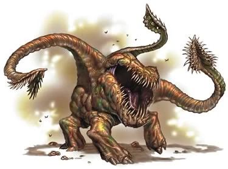
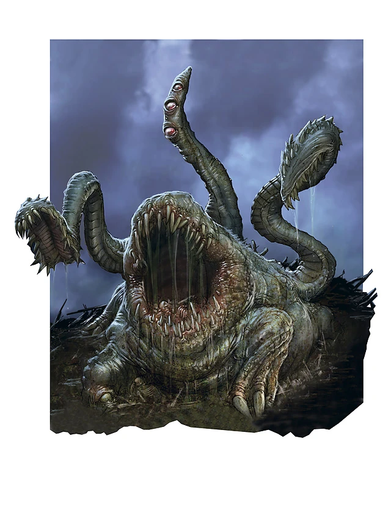
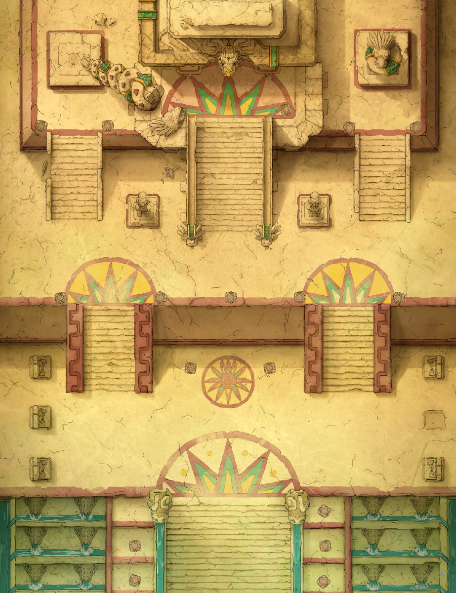
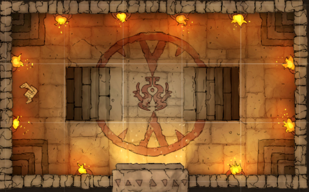
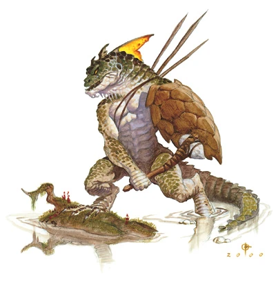
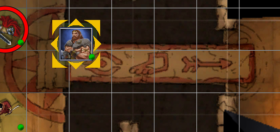
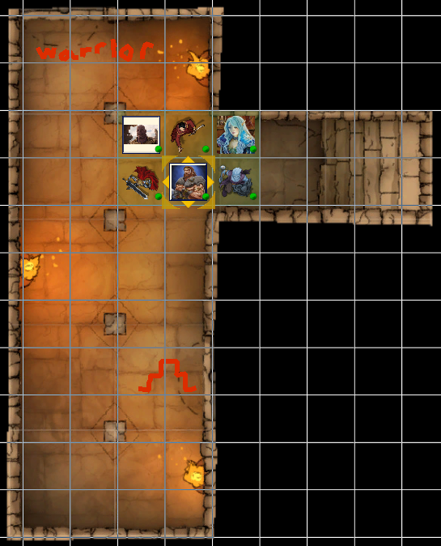
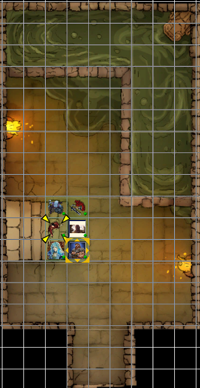
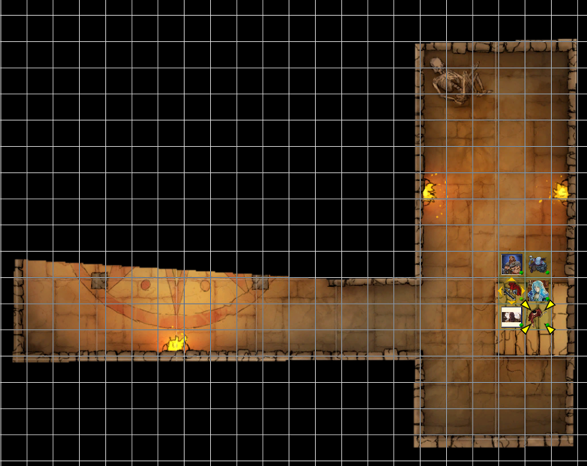
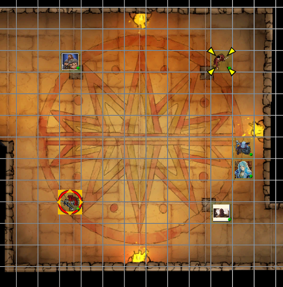

## Outline
1. [Overview](Overview)
   1. [Session Important Notes](#session-important-notes)
   2. [Session Actions Taken](#session-actions-taken)
2. [Session Details](#session-details)

3. [Items & XP](#items--xp)
   1. [Items Received](#items-received)
   2. [Experience Received](#experience-received)
4. [Conclusions](#conclusion-items)
   1. [Active Questions](#active-question-notes-self)
   2. [Action Items](#action-items-(previous))
   3. [Map Marks](#map-marks)
5. [Previous Items](#previous-items)
   1. [Previous Action Items](#previous-action-items)
   2. [Previous Map Marks](#previous-map-marks)
   3. [Previous Items Added](#previous-items-added)
______________________________
## Overview
**Previous Session Recap:**
- Refer to [14-SEP-25](14-SEP-25.md) Notes 
- In the Bone Zone
- Exploring Temple
- Cyclops area / past the first area -> completed wrath battle
- Talked to skeleton who only tells lies
- Got the key from the wrath
- Tried all combinations for the compass room until it worked

_____________________________________
## Session Details
> [!Note]
> _Sections that are copied from the previous session are indictated (easier to see all of the same parts in on location)_

# Bone Zone
_Copy from previous session_ 
- Alabaster can enter and exit at the boundary site with no issue
- 1in deep for bones / trying to not crunch them but not possible
- Clearly was a battlefield
- Heading towards the temple
- Alter at the temple location
  - No enclosued / steps leading up to it
  - One at the front of the temple and 2 at the sides as well 
  - _Probably_ one at the back

## Front Alter / Temple
_Copy from previous session_ 
_In the bone zone_

- Walk up to the front alter
  - There is a scripture 
  - Draconic 
  - on the alter is a small jade statue
  - statue of a spider with its arms all curled
- Helra doesn't know this from her knowledge
  - Taurus also
  - Seems religous and region 
- Scripture states:
  - the spider the eight eye lord of the night
- Statue is universe magic 
  - enchanted 
  - similar to the magic on magic keys for opening things 

## Left Alter
_In the bone zone_ 

_Checking out the other alters_
  - Left one -> jade idol there too
  - Three eyes three tentacles and three feet
    - three eyes on one tentacle 
  - Three eyed princed 

 
 

## Back Alter
_In the bone zone_
- Alter has a monkey with his hands over his ears
- 2 eyed prince of the sun- monkey

## Right Alter
_In the bone zone_
- Cyclops for the statue with his staff
- 1 eyed lord of light, bringer of magic

> [!Note]
> Decided we will leave the statues / keys alone for now
> Heading to Temple 

## Temple Entraence 

_Heading to the enterance_

- Taurus looks at the stone work 
- Can't tell much from it
  - General: 6/10 for stone workmanship
- Hallamir knocks on the door
  - No response
- Stone door just opens / no lock
  - Looks like the following: 

- There are depictions of lizardfolk in their day to day tasks 
- Look like something like this: 

- Alabaster and Hallamir listen down each location available:
  - Hears nothing down the left staircase (otyugh)
  - Hears running water down the right staircase (cyclops)

> [!Note]
> Decided that we will go down the right staircase (cyclops) that has a 

### Cyclops Room 
_Copy from previous session_ 

#### Left Area
_Copy from previous session_ 
- Two statues kneeling with a gold coin
- Offer a gold coin
  - Hand comes out of the wall and takes it 
  - Everyone does this
  - Statues state we can proceed

#### Right Area
_Copy from previous session_ 
- 2 stone slaps 
- Nothing of note / depicts of the temple

#### Middle Area
_Copy from previous session_ 
- Bridge with symbols
  - Eye, Foot, Arrow
- Goes over a pit 
  - Very deep / into acid (Allabaster chucks a stone)
- Two Snek statues on either side with their mouth open 
- Lever inside of their mouths
  - Once pulled -> something is rumbleded / something is moved 
  - Requires both to be pulled and they release once released
  - Used rope and bridge as a weight to keep them in the enaged option

  

#### Across Bridge
_Copy from previous session_ 

##### North
_Copy from previous session_ 
- Hand depiction 
- Can be opened but not sure how it activates for the wall 

##### South 
_Copy from previous session_ 
- Cow depiction
- Can be opened but not sure how it activates for the wall 

> [!Note]
> Traveled back into the other room with leaving the ropes / levers for the statue enaged.

---------------------

### Cyclop In-Between Room
_Copy from previous session_ 
There is a depiction of a warrior on the north wall. There are 4 pillars in the room. Hallamir checks them out / bit have something inside them or something hidden. If you touch them, something bad will happen. (Alabaster checks them out). Can be dispelled potentially for the disable device or dispell magick.

- Hallamir gives it a go / 250 gold piece ruby obtained (Hallamir) (Pillar 1)
- Pillar 2- cannot see where it is
- Pillar 3- cannot see where it is
- Pillar 4- can see it / very easy / chipped 
  - Pulls it out -> Hallamir

#### North
_Copy from previous session_ 
- Warrior Depiction 
- Abjuration Magick
  - Weak 1-3 level

#### South 
_Copy from previous session_ 
- Hidden wall that can open out to the bottom right
  - Taurus and Alabaster pressing on the tiles / slabs
  - Requires someone to be on there for the hidden wall to be opened
- There is a spike wall at the top in it
- Warrior wall opens up when the statue in the hidden room is touched
  - Spiked wall starts to come down in that time period though
  - When let go -> warrior room closes back 

- Leeve and Harim move to press the slabs instead for keeping the hidden wall 
- Taurus to go into the hidden spike room and touch the statue
- Hallamir to quickly search the warrior room 
- Taurus to let go once Hallamir is in

#### Warrior Room 
_Copy from previous session_ 
- 3 doors
- Snek that is open
- Monkey door that is closed
- Warrior door (just walked through) / closed
- Hallamir walks through the snek door

#### Snek Door
_Copy from previous session_ 
- There is a fork in the road
- Center of the hall:
  - Right there is a wall of spike with a plate on the floor 
    - Picture of a cow
  - End of the hallway: Skull with a skull with gems for eyes

_Plan_ 
> [!Note]
> Taurus opens the Warrior Door again for Hallamir after around 5 mins of not hearing anything. Hallamir comes back and relays the information. Hallamir is by the cow door with Taurus. Helra goes through the Warrior door to activate the cow pressure plate in the snek door. Alabaster opens the warrior door via the spike room. Leeve and Harim still at the pressure plates in the first area. 

- Once Helra opens the cow, the spikes do not move but opens the door for Hallamir and Taurus. 
- Tiny room for cow room for Hallamir and Taurus
  - Skull pressure plate in there

> [!Warning]
> Helra hears a scream in the area she is in down the hallway? (which?) INIT roll for everyone but Helra is the only one that hears it. 

- Skull with gem eyes is flying down the hall towards Helra
- Helra preps to attack / doesn't want to move off the pressure plate
- Alabaster hears the screams and sends of his imp
- Taurus goes walking to tell everyone else that we found the skull plate
- Hallamir steps on the skull plate
- Taurus keeps walking
- Helra preps for any remaining skulls to charge down
- Imp comes back 
- Taurus meets up to Helra tells them that Hallamir is on the skull plate and can go off
- Decide that I'll just stay on here and Taurus can go up and check out the skull plate room and not touch anything yet until the imp can update everyone
- Taurus ends up pressing the hand plate and Hallamir can exit off the skull plate
- Helra mets up to Alabaster and we all meet at the main location with the bridge
- Offer another gold coin to the priest 
  - Helra (-1 gold)
- Go by the hand door
- Enter the hand door (everyone together)

_Small cow door if that was closed while someone was in it would have killed them with lack of air..._
 
- Warrior spike secret door
  - Needs two people by the slabs to have that door open
- Spike Secret door opens Warrior door
- Snek door opens with the snek levers being pulled at the bridge
- Cow door opens with the cow button pressed that is behind the warrior / snek door
- Skull door opened by the skull pressure plate in the cow room 
- Skull room has the hand pressure plate to open the hand door
- Monkey room unknown

### Hand Door
_Copy from previous session_ 
There is a left and right staircase. Hallamir can hear water flowing in the direction of the right one but not the left one.

#### Right Staircase
_Copy from previous session_ 
The following map is visible:

There is a lizardfolk statue in the water. Then a skeleton creature comes out of the water (mound of bones) that assembles itself. (INIT)
Door at the bottom with the following symbols:

##### Mound of Bones
_Copy from previous session_ 
- Hallamir hits first 
  - Scimitar of Colors -> electric
    - Doesn't appear to be impacted by the electric damage
- Helra hits / creature is evil
- Leeve misses an ice knife
- Alabaster puts on his coat
- Harrim attacks / misses
- Creature attacks Helra
  - 12 + 10 dmg
- Taurus smashes creature away from pool
  - Tis dead
- Alabasters turn / doesn't know there is something else around
- Helra detects evil in the water / nothing around
  - Helra uses a holy water bottle and says a prayer
    - +5 concordance
- Leeves turn / doesn't know what is going on and stands next to Harrim 
- Harrim is still cautious
- Taurus turn: heads to Alabaster
- Another creature of bones comes out of the water
  - Attacks Taurus who has their back turned
- Hallamir chucks ones of the orbs of driness (100 galloons)
  - Sucks up a lot of the water but not all of 
- Helra: takes time to investigate  /call to Taurus that I will be over there in a bit
  - Water and statue the water is coming out is evil 
  - Cannot see the bottom of the water
  - There are a lot of bones in the water
  - Check the bones of the previous creature that was killed
    - No inscriptions on the bones
    - Helra doesn't think these will rise up afterwards since she didn't deliver the last blow on them (like the undead in the black)
- Alabaster:
  - Door handle not there / same as other doors we have interacted with.
- Taurus finishes off the other creature
- Helra is going to try to smash the creature head
  - 27 dmg to the head / statue
- Alabaster and Leeve heading out of the room
  - Hallamir leaving as well with 
- Helra hits the head two more rounds and then pours another holy water into the pool 
- Heads up to the others / going to the left staircase

#### Left Staircase
_Copy from previous session_ 
The following map is visible:

- Humanoid skeleton in the top 
  - Enchanted with illusion magick
  - Moderate strength
- Deer floor plate next to the skeleton 

##### Skeleton Zone
_Copy from previous session_ 
- Hallamir approaches
  - It speaks
  - We have entered the underworld and he is our guardian and we may ask him a question and he must tell us the truth. (Kornaus is his name)
  - How to solve all the puzzles
    - Goes through all the ones we have seen at least
  - why is it cold
    - Just some cold spots
  - Need to beat all the guys in order to bet the other room
  - Can insult the statue that asked for a coin / you don't have to do that
    - WIll open all the doors if you defeat them 
    - WIll only be mad if you insult its family
- Taurus explores the opened area
  - Its very cold in that room 
  - Craved on the wall to the north: 
    - Hunting scene, monkey in the trees, a city with the temple, farms in front of it with windmills
      - All the symbols up to this point are represented on the mosiac 
  - Door to the west as a wolf on it
  - Compass on the floor
- Demon priest depicted as well
- Allabaster presses the deer button after the skeleton says it doesn't do anything
  - There is noise and sounds like it does something
  - Resets once moved off of it

##### Compass Room Solution
_Copy from previous session_ 
- Compass -> step on all four of them at once is the key
- Everyone stands on a button in the next room

- INIT (appears the skeleton has lied the first time)
- A ghost like creature appears in the middle of the compass
  - Bigger version of what killed Mullane previously 
  - Wrath / White -> raises you as an undead if it kills you
- Helra has already healed since the last room (22 -> heal slaps)

> [!Note]
> Helra is onboard with Alabaster in killing the skeleton in the other room now with this.

##### Wrath Battle 
_Copy from previous session_ 
- Helra (-22 heal slaps currently)
- Helra first damanged -> 6 CON damange...
- Alabaster -> Summon Monster 6 -> Saline (Wolf Celestinal Boi)
- Taurus moves off the button to attack and wrath disappears
- Leeve and Harrim go on the button freeing up Taurus and Hallamir
- Harrim misses
- Taurus moves in
- ALabaster / Harrim Hastes -> Hallamir + Helra + Imp
- Helra kills the Wrath 
- Key drops -> small bronze key

##### Skeleton Zone
_Copy from previous session_ 
- Helra confront's them 
- States he can only tell truths
- Helra uses Zone of Truth
  - Skeleton can not speak
  - Only lies...
- Zanbin is his name (actually potentially)
- What doesn't this key lock 
  - 

##### Compass Room 
_Copy from previous session_ 
- The buttons don't have any images
- Bottom Left -> Click
- top left -> top right -> grinding underground happens -> step off they both reset -> something has happened with that though still 
  - Other side of the wolf door maybe
- A mixture of combination and something things happened 
  - A bunch of open doors in other locations appear to occur

##### Pool Room 
_Copy from previous session_ 
- One of the room doors there is opened now. 

----------------------

> [!Note]
> Start of non-copied previous session notes!

#####

---------------------

## Items & XP
### Items Received
- N/A

### Experience Received
**Previous Total:** 81,688 _(Updated with Discord version)_
**Adjustments:** +975 EX
**Total:** 82,663

_________________________________
## Conclusion Items
### Active Question Notes (Self)
- Talking with the Nymmurh 

### Action Items
- Need finish asking Nymmurh questions

### Map Marks
- Draconic Cave Entrance 
- Dust Man / Travelers Inn

---------------------------------
## Previous Items
### Previous Action Items
- [ ] Alabaster wishes to visit the magic shop at some point in time that we almost got caught stealing from in the past / got locked up that was nearby. Geistwatch. Ruby golem.
- [ ] Alabaster wants to grab the winter cloths he left in the cart that is on the ship doing shipments.
- [ ] Alabaster tells his imp that he should keep an eye out on what person would be good to kill for a ritual spell that he his thinking about doing. 
- [ ] To check-in with Ferbin at some point when in Clambank on the shipment of steel and weapons and if there is a prep for war or something or general shipment. (Town that had faulty ore orginally)

#### Previous Map Marks
- **Marked Stagfort** on the map
- **Marked the ship anchor** on the map for investigating
- **Marked Redleaf** on the map
- **Marked which trail was used more** from the abandon Pitish village
  - North West direction
- **Marked** Witch Hut in Horde grave swamp  (On route to IO)
- **Marked Horsegrave** to avoid due to drunk crusades   (On route to IO)
- **Marked** prototype dragon location  (On route to IO)
- **Marked** Draconic Cave Entrance   (On route to IO)
- **Marked** Dust Man Travelers Inn   (On route to IO)

#### Previous Items Added
_Listing of items that haven't been added to inventory notes yet from previous sessions for reference so they do not get forgotten._
- **Prototype Manual** 
  - For (D.R.A.G.O.N.)