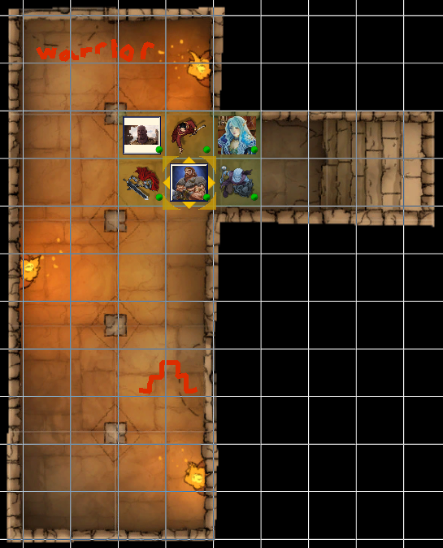
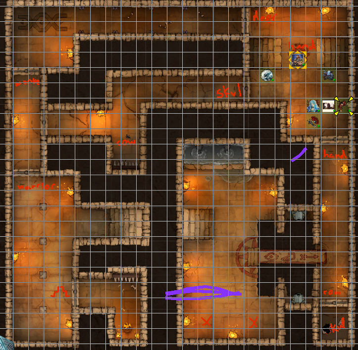

## Outline
1. [Overview](Overview)
   1. [Session Important Notes](#session-important-notes)
   2. [Session Actions Taken](#session-actions-taken)
2. [Session Details](#session-details)

3. [Items & XP](#items--xp)
   1. [Items Received](#items-received)
   2. [Experience Received](#experience-received)
4. [Conclusions](#conclusion-items)
   1. [Active Questions](#active-question-notes-self)
   2. [Action Items](#action-items-(previous))
   3. [Map Marks](#map-marks)
5. [Previous Items](#previous-items)
   1. [Previous Action Items](#previous-action-items)
   2. [Previous Map Marks](#previous-map-marks)
   3. [Previous Items Added](#previous-items-added)
______________________________
## Overview
**Previous Session Recap:**
- Refer to [10-AUG-25](10-AUG-25.md) Notes 
- In the elf city area spotted
- Traveled to the middle area
- Found the Bone zone
- Activated at night / a lot of bones
- Temple in the bone zone
- Went to the temple and left the keys on the alters alone

_____________________________________
## Session Details
> [!Note]
> _Sections that are copied from the previous session are indictated (easier to see all of the same parts in on location)_

# Bone Zone
_Copy from previous session_ 
- Alabaster can enter and exit at the boundary site with no issue
- 1in deep for bones / trying to not crunch them but not possible
- Clearly was a battlefield
- Heading towards the temple
- Alter at the temple location
  - No enclosued / steps leading up to it
  - One at the front of the temple and 2 at the sides as well 
  - _Probably_ one at the back

## Front Alter / Temple
_Copy from previous session_ 
_In the bone zone_

- Walk up to the front alter
  - There is a scripture 
  - Draconic 
  - on the alter is a small jade statue
  - statue of a spider with its arms all curled
- Helra doesn't know this from her knowledge
  - Taurus also
  - Seems religous and region 
- Scripture states:
  - the spider the eight eye lord of the night
- Statue is universe magic 
  - enchanted 
  - similar to the magic on magic keys for opening things 

## Left Alter
_In the bone zone_ 

_Checking out the other alters_
  - Left one -> jade idol there too
  - Three eyes three tentacles and three feet
    - three eyes on one tentacle 
  - Three eyed princed 

 
 

## Back Alter
_In the bone zone_
- Alter has a monkey with his hands over his ears
- 2 eyed prince of the sun- monkey

## Right Alter
_In the bone zone_
- Cyclops for the statue with his staff
- 1 eyed lord of light, bringer of magic

> [!Note]
> Decided we will leave the statues / keys alone for now
> Heading to Temple 

## Temple Entraence 

_Heading to the enterance_

- Taurus looks at the stone work 
- Can't tell much from it
  - General: 6/10 for stone workmanship
- Hallamir knocks on the door
  - No response
- Stone door just opens / no lock
  - Looks like the following: 

- There are depictions of lizardfolk in their day to day tasks 
- Look like something like this: 

- Alabaster and Hallamir listen down each location available:
  - Hears nothing down the left staircase (otyugh)
  - Hears running water down the right staircase (cyclops)

> [!Note]
> Decided that we will go down the right staircase (cyclops) that has a 
___________________________________________

> [!Note]
> Start of actual session notes here / not copied over

### Cyclops Room 

#### Left Area
- Two statues kneeling with a gold coin
- Offer a gold coin
  - Hand comes out of the wall and takes it 
  - Everyone does this
  - Statues state we can proceed

#### Right Area
- 2 stone slaps 
- Nothing of note / depicts of the temple

#### Middle Area
- Bridge with symbols
  - Eye, Foot, Arrow
- Goes over a pit 
  - Very deep / into acid (Allabaster chucks a stone)
- Two Snek statues on either side with their mouth open 
- Lever inside of their mouths
  - Once pulled -> something is rumbleded / something is moved 
  - Requires both to be pulled and they release once released
  - Used rope and bridge as a weight to keep them in the enaged option

#### Across Bridge

##### North
- Hand depiction 
- Can be opened but not sure how it activates for the wall 

##### South 
- Cow depiction
- Can be opened but not sure how it activates for the wall 

> [!Note]
> Traveled back into the other room with leaving the ropes / levers for the statue enaged.

---------------------

### Cyclop In-Between Room
There is a depiction of a warrior on the north wall. There are 4 pillars in the room. Hallamir checks them out / bit have something inside them or something hidden. If you touch them, something bad will happen. (Alabaster checks them out). Can be dispelled potentially for the disable device or dispell magick.

- Hallamir gives it a go / 250 gold piece ruby obtained (Hallamir) (Pillar 1)
- Pillar 2- cannot see where it is
- Pillar 3- cannot see where it is
- Pillar 4- can see it / very easy / chipped 
  - Pulls it out -> Hallamir

#### North
- Warrior Depiction 
- Abjuration Magick
  - Weak 1-3 level

#### South 
- Hidden wall that can open out to the bottom right
  - Taurus and Alabaster pressing on the tiles / slabs
  - Requires someone to be on there for the hidden wall to be opened
- There is a spike wall at the top in it
- Warrior wall opens up when the statue in the hidden room is touched
  - Spiked wall starts to come down in that time period though
  - When let go -> warrior room closes back 

- Leeve and Harim move to press the slabs instead for keeping the hidden wall 
- Taurus to go into the hidden spike room and touch the statue
- Hallamir to quickly search the warrior room 
- Taurus to let go once Hallamir is in

#### Warrior Room 
- 3 doors
- Snek that is open
- Monkey door that is closed
- Warrior door (just walked through) / closed
- Hallamir walks through the snek door

#### Snek Door
- There is a fork in the road
- Center of the hall:
  - Right there is a wall of spike with a plate on the floor 
    - Picture of a cow
  - End of the hallway: Skull with a skull with gems for eyes

_Plan_ 
> [!Note]
> Taurus opens the Warrior Door again for Hallamir after around 5 mins of not hearing anything. Hallamir comes back and relays the information. Hallamir is by the cow door with Taurus. Helra goes through the Warrior door to activate the cow pressure plate in the snek door. Alabaster opens the warrior door via the spike room. Leeve and Harim still at the pressure plates in the first area. 

- Once Helra opens the cow, the spikes do not move but opens the door for Hallamir and Taurus. 
- Tiny room for cow room for Hallamir and Taurus
  - Skull pressure plate in there

> [!Warning]
> Helra hears a scream in the area she is in down the hallway? (which?) INIT roll for everyone but Helra is the only one that hears it. 

- Skull with gem eyes is flying down the hall towards Helra
- Helra preps to attack / doesn't want to move off the pressure plate
- Alabaster hears the screams and sends of his imp
- Taurus goes walking to tell everyone else that we found the skull plate
- Hallamir steps on the skull plate
- Taurus keeps walking
- Helra preps for any remaining skulls to charge down
- Imp comes back 
- Taurus meets up to Helra tells them that Hallamir is on the skull plate and can go off
- Decide that I'll just stay on here and Taurus can go up and check out the skull plate room and not touch anything yet until the imp can update everyone
- Taurus ends up pressing the hand plate and Hallamir can exit off the skull plate
- Helra mets up to Alabaster and we all meet at the main location with the bridge
- Offer another gold coin to the priest 
  - Helra (-1 gold)
- Go by the hand door
- Enter the hand door (everyone together)

_Small cow door if that was closed while someone was in it would have killed them with lack of air..._
 
- Warrior spike secret door
  - Needs two people by the slabs to have that door open
- Spike Secret door opens Warrior door
- Snek door opens with the snek levers being pulled at the bridge
- Cow door opens with the cow button pressed that is behind the warrior / snek door
- Skull door opened by the skull pressure plate in the cow room 
- Skull room has the hand pressure plate to open the hand door
- Monkey room unknown

---------------------

## Items & XP
### Items Received
- N/A

### Experience Received
**Previous Total:** 81,688 _(Updated with Discord version)_
**Adjustments:** +975 EX
**Total:** 82,663

_________________________________
## Conclusion Items
### Active Question Notes (Self)
- Talking with the Nymmurh 

### Action Items
- Need finish asking Nymmurh questions

### Map Marks
- Draconic Cave Entrance 
- Dust Man / Travelers Inn

---------------------------------
## Previous Items
### Previous Action Items
- [ ] Alabaster wishes to visit the magic shop at some point in time that we almost got caught stealing from in the past / got locked up that was nearby. Geistwatch. Ruby golem.
- [ ] Alabaster wants to grab the winter cloths he left in the cart that is on the ship doing shipments.
- [ ] Alabaster tells his imp that he should keep an eye out on what person would be good to kill for a ritual spell that he his thinking about doing. 
- [ ] To check-in with Ferbin at some point when in Clambank on the shipment of steel and weapons and if there is a prep for war or something or general shipment. (Town that had faulty ore orginally)

#### Previous Map Marks
- **Marked Stagfort** on the map
- **Marked the ship anchor** on the map for investigating
- **Marked Redleaf** on the map
- **Marked which trail was used more** from the abandon Pitish village
  - North West direction
- **Marked** Witch Hut in Horde grave swamp  (On route to IO)
- **Marked Horsegrave** to avoid due to drunk crusades   (On route to IO)
- **Marked** prototype dragon location  (On route to IO)
- **Marked** Draconic Cave Entrance   (On route to IO)
- **Marked** Dust Man Travelers Inn   (On route to IO)

#### Previous Items Added
_Listing of items that haven't been added to inventory notes yet from previous sessions for reference so they do not get forgotten._
- **Prototype Manual** 
  - For (D.R.A.G.O.N.)