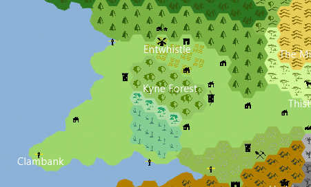
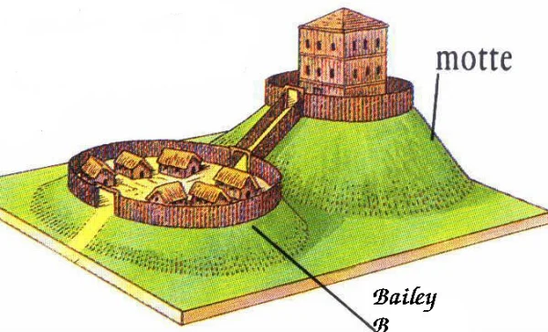

# Keep Status

## Map Information

### Layout

---------------------------------------------

## Main Sites

### Tavern
- Hallamir runs / in charge of this.
- Xorn cross-section fossil mounted over the fireplace.
- Main station for the Water Rats to hang out.
- Marcus sometimes will be station here as the chef.

### Wizard Tower
- Alabaster's Wizard Tower
- Has a 'play pen' for Grimmore in the back.
  - Covered in a snowy biome 
  

### Dwarf Brothel
- Mostly female dwarves
- Incident happened in the past with a misunderstanding and difference between dwarf and human cultures.
  - Human males cheating on their wives at the brothel which is unheard of in dwarf culture.
- Is next to the school
- Income: 50g

### Water Mill

##### Income
- 250g (3 months)

### Shrine
- Helra and Lethe in charge of running

### Trading Post
- Consists of the trading ship and the post

##### Income
- Ship 500g (3 months)
- Post 500g (3 months)
- 
### School
- Made to help with the language differences between the humans and the dwarves.
- Is next to the Dwarf Brothel
- Built on [07-JUL-24](Session%20Notes/07-JUL-24.md)

### Town Houses
- Houses made mostly by the dwarves / quicker at building
- Decent population / not just tents

### Farm Lands
#### Goat Status
- Female: 
- Male: 
- Pregnant (7)
- Stonefeet (Galus Berrytoe) is the shepard
- Helped Find the Mining Site

##### Income
- 22g 97s (3 months)

### Mining Site
- Galus Berryto

-----------------------------------------

## Treasury
- 1000g available
- Collected income from the keep in [18-AUG-24](Session%20Notes/)

### Collection 
- Collect every 3 months
- (They get sheared every 3 months)

-----------------------------------------
## Population
- Humans & Dwarfs Mainly
- Water Rats
- Niria (Birdfolk)

.md)

-----------------------------------------

## Request Log
- 100g for making the celebration bigger for [18-AUG-24](Session%20Notes/)
  - Accepted / Helra re-fills treasury back 100g