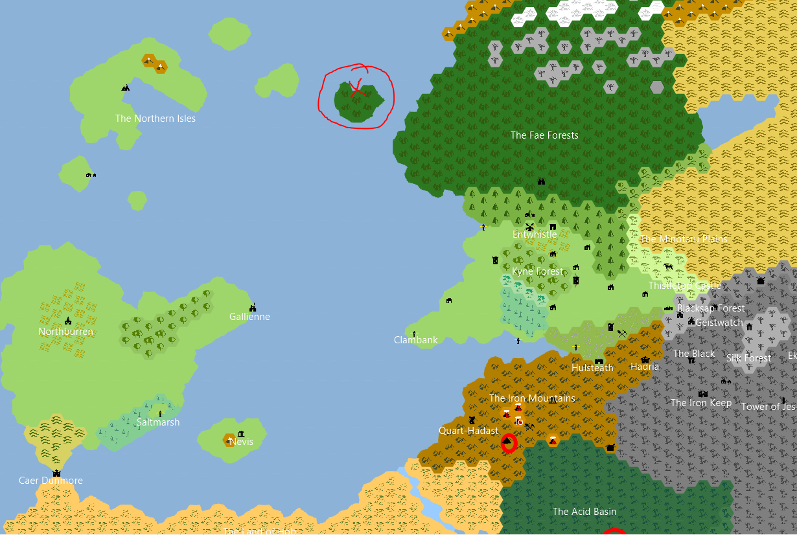
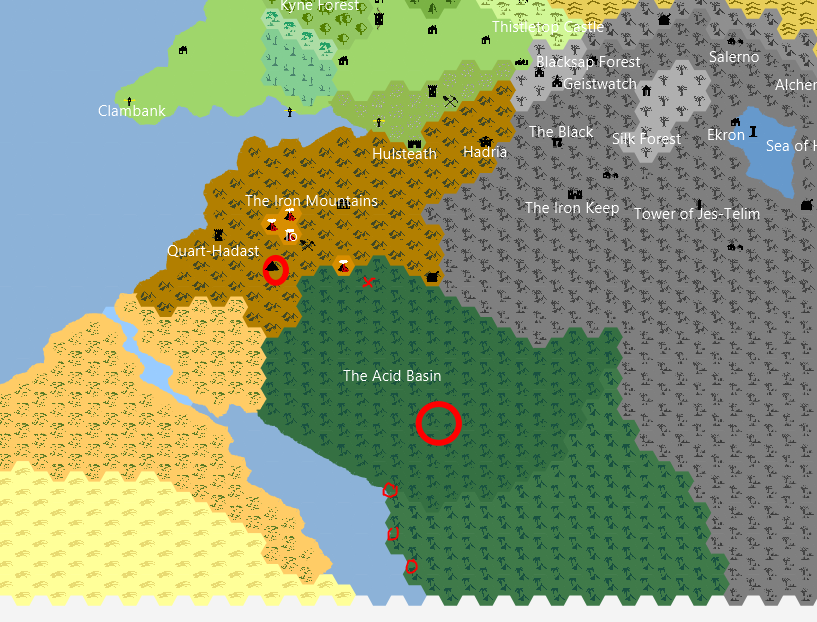

# Perigord
Repository for storing any associated notes in markdown or other formats for easier viewing & sharing.  

Contains only notes for the current homebrew 3.5e active campaign `Perigord` and related images for NPCs, items, maps,
monsters, and places for reference.

--------------------------
## [Session Notes](DnD%20Notebook/Session%20Notes/)
### Available Notes
- **Start Date:** [12-MAY-24](DnD%20Notebook/Session%20Notes/12-MAY-24.md)  
- [09-JUN-24](DnD%20Notebook/Session%20Notes/09-JUN-24.md)  
- [16-JUN-24](DnD%20Notebook/Session%20Notes/16-JUN-24.md)  
- [07-JUL-24](DnD%20Notebook/Session%20Notes/07-JUL-24.md)  
- **Last Update:** [11-AUG-24](DnD%20Notebook/Session%20Notes/11-AUG-24.md)  

-------------------------

## World Maps
Quick references to the world map for the active campaign are copied below.  Any other maps can be found under [images](Images/) 
in the [maps](Images/Maps/) directory.

  

  

------------------------

## [Images](Images/)
The [images](Images/) directory contains a working upload listing of pictures for Companions, Important NPC's, Items,
Maps, Monsters, and Places.